## XRP Shop Widget
This project was bootstrapped with [Create React App](https://github.com/facebookincubator/create-react-app).
Below you will find some information on how to perform common tasks.

## Demo

  [Screencapture demo on Youtube](https://youtu.be/HlNEriQgSpc)

## Display looks
<table>
<tr><td>
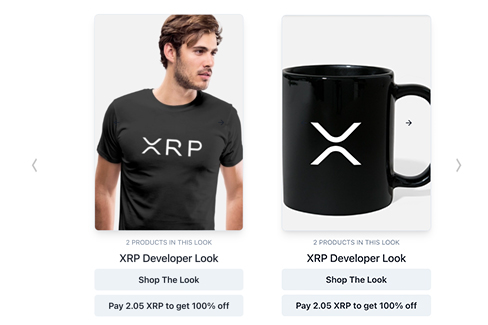
</td>
</tr>
</table>
- Fetchings looks data using api request 
```
-src
  |-store
    |-looks

```
```
const { data } = await axios.get(`${process.env.REACT_APP_API_SHOPLOOKS_SERVER_URL}/api/get_looks?shop=${shop}&id=${id}`);
```
- Display data in carousel using Recat Slick


```
-src
  |-routes
    |-Embed.js

```
  - Look data to display in carousel 
  ```
  <Carousel medias={look.medias} height={400} width={275} />
  ```

## Payment Modal Popup
- Parsing payment data to payment modal on click of payment button

```
<XrpModal lookXrpPrice={look.xrpPrice} lookImage={look.medias} lookId={look.id || look.objectId} lookName={look.name} />

```
```
-src
 |- xrp-payment-modal
  |- index.js
```
<table>
<tr>
<td>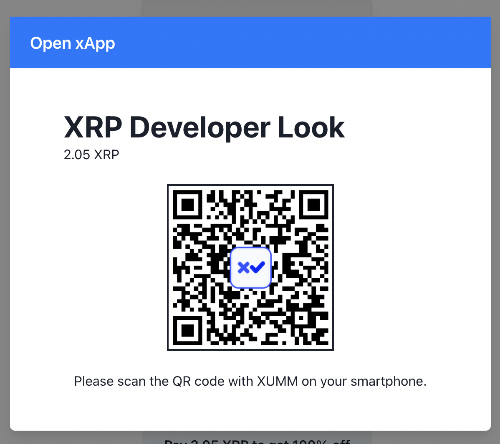</td>
</tr>
</table>

- Fetching payment data using api by parsing shop name and lookId
    - will get product data, xrp price, qr-code for payment using xumm app
```
-src
  |- store
    |- xrpl
```

```
const { data } = await axios.get(`${process.env.REACT_APP_API_SHOPLOOKS_SERVER_URL}/api/get_xrp_payment?shop=${shop}&id=${lookId}`);

```

  - create new **Websockt** connection to interact with api request while posting the payment requet 

```
const onPayClick = async ({ lookId }) => {
    onOpen();
    const data = await postXummPayment({ lookId, shop });
    
    const client = new WebSocket(data.status);

    client.onopen = () => {
      console.log("Connected.....");
    };

    client.onmessage = async (e) => {
      const newObj = await JSON.parse(e.data);
      console.log(e.data, newObj);
      console.log(newObj.txid);
      const txid = await newObj.txid;
      console.log(txid);
      if(txid !== undefined){
        const resp = await verifyXummPayment({ txid });
      } 
    };
  };
```
  - once the payment is done will get the response from XUMM App.
    - for more details refer the API documentation in [XUMM Website](https://xumm.readme.io/)

  - post the transaction id get from payment response to verify
```
const { data } = await axios.get(`${process.env.REACT_APP_API_SHOPLOOKS_SERVER_URL}/api/verify_xrp_payment?txid=${txid}`);
```
  - display the transaction response 
```
-src
  |-components
    |-- xrp-payment-modal
      |--- discount.js
```
<table>
<tr>
<td>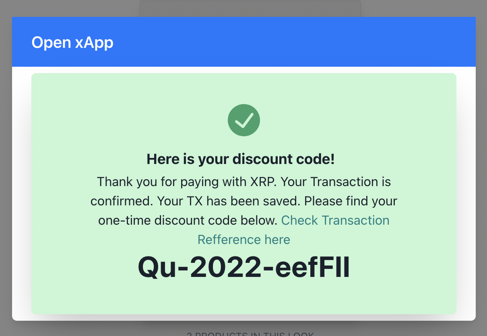</td>
</tr>
</table>

```
-src
  |-components
    |-- xrp-payment-modal
      |--- discount.js
```

## Payment Uusing XUMM app
- Open Xumm app in your smartphone
- Scan the qr code displayed on screen
- Review and sign the transaction 
- you can see the transaction details in Xumm App
- After the transaction is completed you will see the success message screen with generated coupen code and link to see the transaction

<table>
<tr>
<td>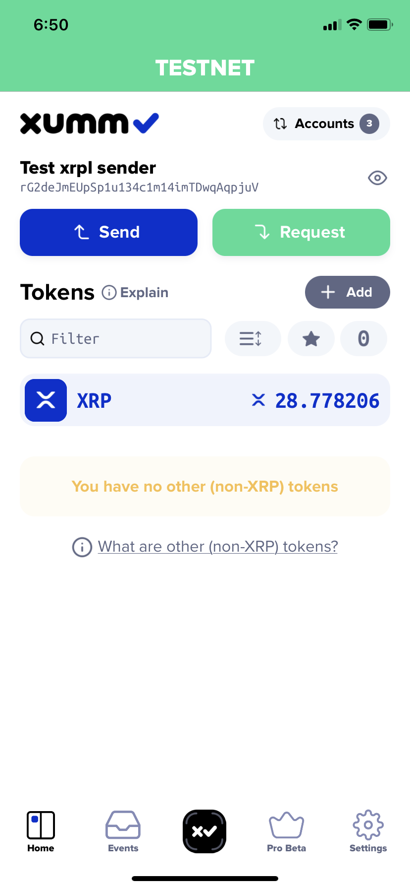</td>
<td>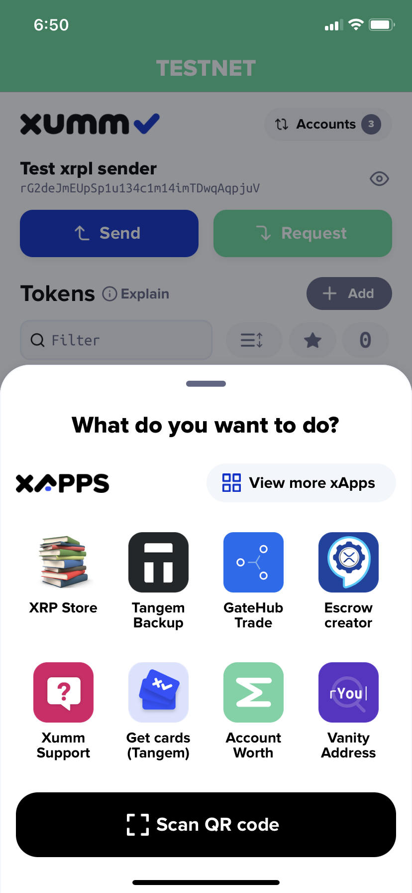</td>
<td>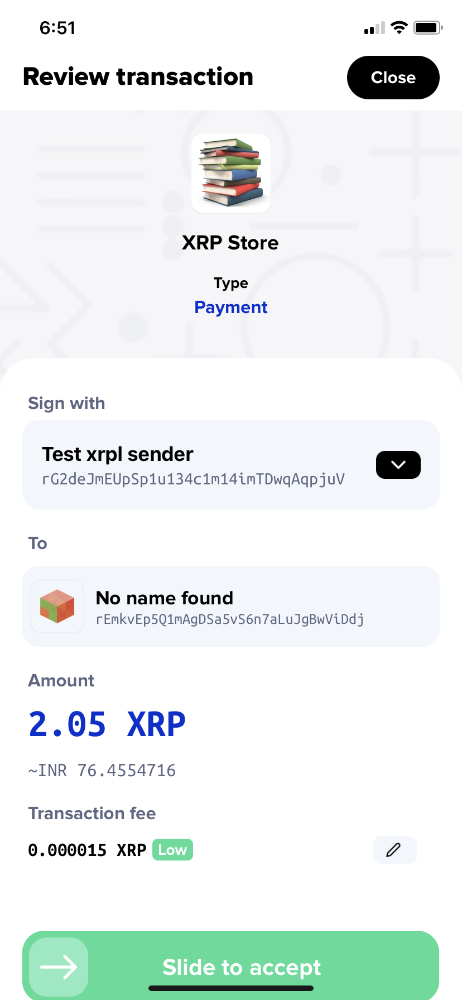</td>
<td>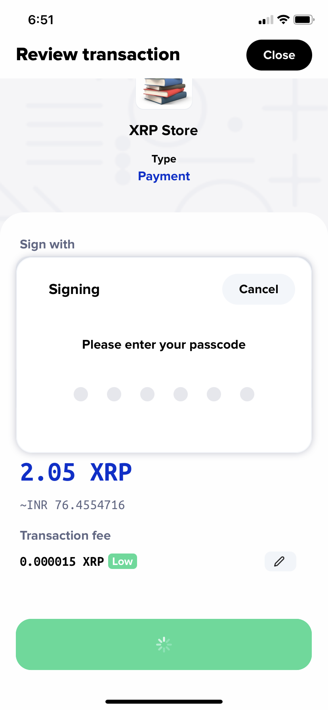</td>
<td>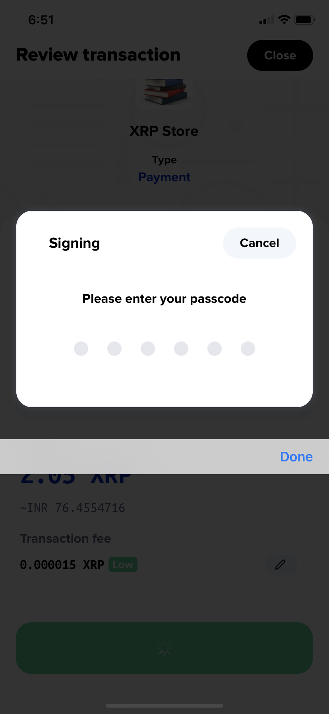</td>
<td>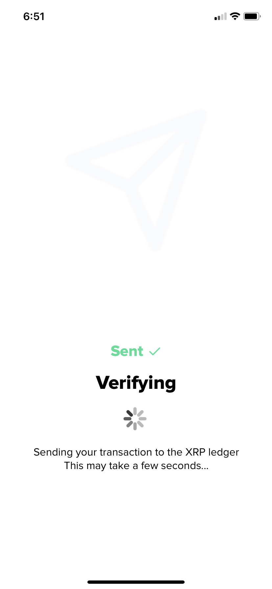</td>
<td>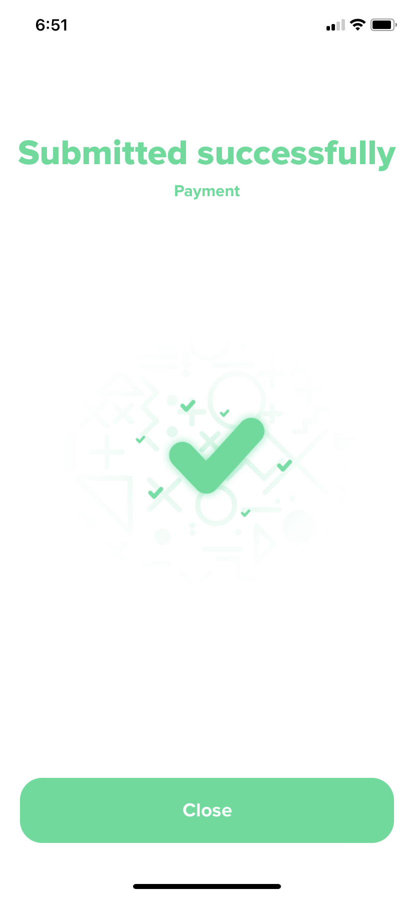</td>
<td>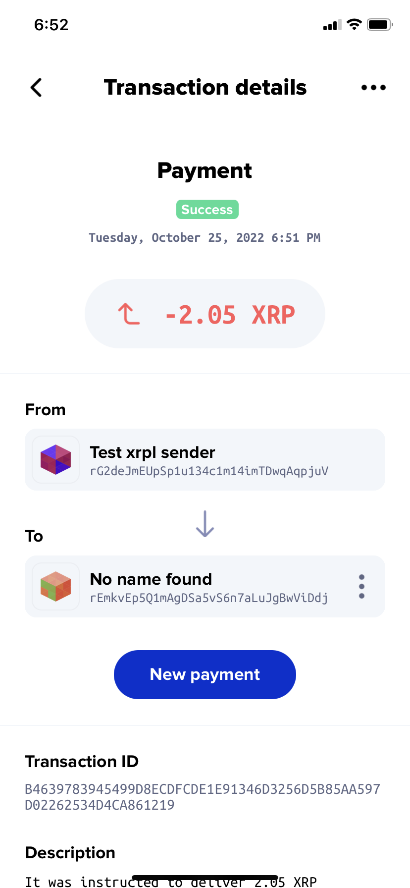</td>

</tr>
</table>
